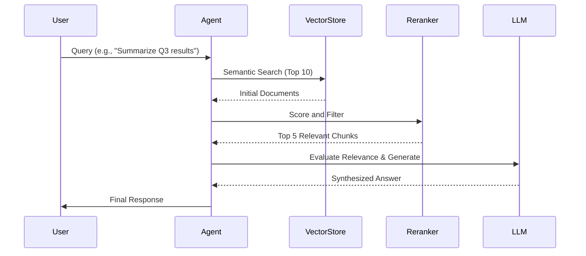

# Agentic RAG Engine 🤖📚

[](https://opensource.org/licenses/MIT)
[](https://www.python.org/downloads/)
[](https://github.com/langchain-ai/langchain)
[](https://www.trychroma.com/)

Advanced Retrieval-Augmented Generation (RAG) system implementing the **Self-RAG** and **Reflexion** patterns. This engine features a cross-encoder reranker and persistent vector storage for high-precision information retrieval and multi-step reasoning.

## 🌟 Key Features
- **Self-RAG Implementation**: Autonomous evaluation of retrieved context and response refinement.
- **Reranking Pipeline**: Integrated `cross-encoder/ms-marco-MiniLM-L-6-v2` for superior document relevance.
- **Persistent Storage**: Utilizes **ChromaDB** for durable and scalable vector indexing.
- **Agentic Reasoning**: Uses ReAct patterns to intelligently orchestrate multi-tool workflows.
- **Modular Design**: Extensible architecture for integrating third-party APIs and custom tools.

## 🔄 Agentic Workflow



## ⚙️ Environment Configuration

| Variable | Description | Default |
|----------|-------------|---------|
| `OPENAI_API_KEY` | Your OpenAI API Key | (Required) |
| `CHROMA_PERSIST_DIR` | Directory for vector database | `./chroma_db` |
| `LOG_LEVEL` | Logging verbosity (INFO, DEBUG) | `INFO` |

## 🛠️ Installation

```bash
git clone https://github.com/dirk-kuijprs/agentic-rag-engine.git
cd agentic-rag-engine
pip install -r requirements.txt chroma-py sentence-transformers
```

## 🚀 Quick Start

1. **Configure Environment**:
   ```bash
   export OPENAI_API_KEY='sk-...'
   ```

2. **Run Inference**:
   ```python
   from rag_agent import AgenticRAGEngine
   
   engine = AgenticRAGEngine(config_path="config.yaml")
   engine.ingest_documents("./data")
   response = engine.query("What are the key findings?")
   print(response["output"])
   ```

## 👨‍💻 Author
**Dirk Kuijprs**  
Data Scientist at G42

Special thanks to **Muhammad Ajmal Siddiqui** for his mentorship and guidance. Connect with him on [LinkedIn](https://www.linkedin.com/in/muhammadajmalsiddiqi/).

## 📄 License
This project is licensed under the MIT License - see the [LICENSE](LICENSE) file for details.
